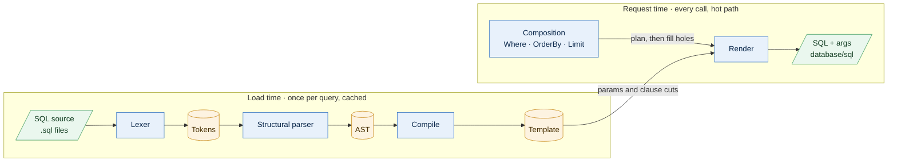

# Architecture

glimt turns hand-written SQL into safe, composable queries. You write SQL once. glimt parses it at load time. At request time you add predicates, ordering and paging, and glimt renders SQL plus bound args for `database/sql`.

This document describes the whole pipeline. Each stage has one job and depends only on the stage before it.

Everything up to the template runs **once**, when a query is loaded. Everything after it runs on **every request**, so those stages must stay allocation-light. Request time never touches the AST: it works on the cached template. A query used as written skips composition, and rendering only numbers the params and binds the args.

## Stages

### 1. SQL source

- **Input:** `.sql` files with named queries (`-- name: listOrders`), each ending with `;` by convention, loaded from an `fs.FS`, normally an `embed.FS`. There is no ad-hoc SQL.
- **Output:** one SQL string per query.
- **Responsibility:** `glimt.Load` walks the files, splits them on `-- name:` annotations (`syntax.SplitFile`), and compiles every query, reporting each problem as a `LoadError` at `file:line:col`. `Registry.Get` returns a query by name and panics when there is none; `Lookup` reports whether there is one.
- **Annotations are strict:** only comments may come before a file's first annotation, a comment that looks like one but isn't (`-- Name: x`, `-- name : x`) is an error, and a query's first keyword reaching the end of another query, as when an annotation is missing, is an error. `SELECT` and `TABLE` end a clause for that reason: both are reserved, and appear inside a clause only in parentheses. `UPDATE`, `INSERT` and `DELETE` can be column names, so two of those statements run together are only caught when the first ends with `;`.
- **Must not:** interpret SQL. Finding annotations uses the lexer's quoting rules, so a `-- name:` inside a string or `$$` body isn't one; everything else is the lexer's job.

### 2. Lexer

- **Input:** one SQL string.
- **Output:** `[]Token`, ending with an `EOF` token.
- **Responsibility:** one pass over the source, following Postgres's scanner with `standard_conforming_strings = on`.
  - Drops comments and records in each token's `Sep` whether whitespace or comments came before it.
  - Classifies each token: identifiers, quoted identifiers, keywords (with their Postgres category), strings (including `E'…'` and `$tag$…$tag$`), numbers, operators (`::` is one operator), punctuation and `:name` parameters.
  - Joins a string literal continued on the next line into one token, as Postgres does.
  - Never marks a word after `.` as a keyword: it's a field name, as in `t.order`.
  - Reads `:` inside brackets, after a name, number or param, as the slice operator, so `arr[lo:hi]` holds no param.
  - Rejects positional placeholders (`$1`) and unterminated quotes or comments. An error holds a byte offset, and `Error.Position` turns it into a line and column.
- **Must not:** know about statements or clauses.

### 3. Tokens

`[]Token` is the only contract between the lexer and the parser. A token is 12 bytes holding offsets into the source, so its text is `src[Pos:End]` and lexing allocates no substrings. `Parse(src)` runs the lexer itself, so no other code produces tokens. The guarantees the parser relies on are listed in the `internal/syntax` package docs (the "lexer contract") and enforced by fuzzing the lexer, not checked again at run time.

### 4. Structural parser

- **Input:** the source. `Parse` runs the lexer itself, so the parser always gets the tokens of the source it is given.
- **Output:** an AST.
- **Responsibility:** answer **structural** questions only:
  - What kind of statement is this?
  - Where do the top-level `WHERE`, `ORDER BY` and `LIMIT` start and end?
  - Is this an `INSERT … SELECT`?
  - Where are the parameters?
  - Is this parenthesized text a subquery?
  - What is the set-operation (`UNION`/`INTERSECT`/`EXCEPT`) structure?
- **Must not:** assign meaning to expressions. It never checks types, resolves columns or validates functions, and it doesn't model `JOIN`s: `FROM` is one opaque span. Anything it doesn't support gets an explicit `glimt: … is not supported` error, never a silent misparse.
- Which keywords can be names follows Postgres's keyword categories (`kwlist.h`): unreserved and column-name keywords can be names, reserved ones can't, and any word can be a column label after `AS`.

### 5. AST

Plain data, with no methods that change it. Every node records the token span it covers, and expressions are token spans that know where their params and subqueries are. The AST exists only during load: `Compile` turns it into a template, and the registry keeps the template and drops the AST.

### 6. Composition

- **Input:** the cached template plus a request's `Builder`: `Where` conditions (`Eq`, `In`, `Like`, `And`, `Or`, …), `OrderBy`/`ThenBy` terms, `Limit` and `Offset`.
- **Output:** the composed query, or its count.
- **Responsibility:** decide what to add, never where.
  - At compile time the template records the top-level statement's composable **clauses**: WHERE, ORDER BY, LIMIT, OFFSET, FETCH and the locking clause. A clause the query has is cut at its start, where its body begins, and at its end; a clause it lacks is cut once, where it would go.
  - The `Builder` turns a request into a `render.Plan`, plain data: whether there is a condition, what to do with ORDER BY, the LIMIT and OFFSET values, and whether to count.
  - Render steps through the template in a `render.Run` that lives on the caller's stack. For each clause it does what the plan says: keep it, jump over it, write it anew or extend it. It stops only at a **hole** where the `Builder` writes its condition or its order terms. Render writes every keyword and separator itself, so the SQL around a hole and the SQL that fills it can't disagree.
  - An existing WHERE becomes `(original) AND (added)`; added conditions are never ORed with it. `BuildCount` drops the tail clauses and wraps the query in `SELECT count(*)`.
- **What can be composed:** a SELECT takes WHERE, ORDER BY, LIMIT and OFFSET; another query (UNION, VALUES, …) takes ORDER BY, LIMIT and OFFSET; UPDATE and DELETE take WHERE. Anything else is an error, and so is replacing a clause that holds a `:param`.
- **Must not:** let request input become SQL text. Values become bound parameters, and columns come from code or from a `Columns` allowlist: each is checked to be a plain column reference that doesn't start with a word Postgres reserves. It works on the shared template and never changes it.

See [Decisions](#decisions) for why composition works on the template and only on the top-level statement.

### 7. Renderer

- **Input:** a template, one value per param name, and any composition.
- **Output:** a SQL string and `[]any` args.
- **Responsibility:** split in two.
  - **Compile (load time):** write the AST as SQL with upper-case clause keywords. Copy expressions, subqueries included, token by token, with a single space wherever the source separated tokens. Cut the text at each param, giving a cached template. When no param expands, the final SQL is built here.
  - **Render (request time):** number `:name` params `$1, $2, …` by first use; a repeated name reuses its number. Bind the values, and expand `IN (:ids)` into one placeholder per slice element. Empty lists, lists of lists, and more than 65,535 args are errors.
- **Must not:** allocate per token, or at all for a query whose params don't expand. Render is the hot path.

## Principles

- **Structural, never semantic.** The parser knows where things are, not what they mean.
- **Sanitize once.** Comments and whitespace are dealt with at load time, never per request.
- **No silent misparse.** Unsupported constructs fail loudly at load time.
- **Values are never interpolated.** Every value becomes a bound arg.
- **Templates are immutable; the AST never outlives load.** Request time works only on templates, which are shared across goroutines and never changed.
- **One direction.** Each stage depends only on the one before it.

## Decisions

### Compose the template, not the AST

Composition splices SQL into the compiled template at clause cuts. It doesn't modify a copy of the AST and compile that per request: compiling costs about 1 µs and 30 allocations on a medium query before any composition work, against 8 ns and no allocations for Render, and composition's cost would grow with the query's size.

### A plan and a run, not a callback interface

Render used to call the `Builder` back through an interface at each anchor. Go must assume a value passed through an interface escapes, so the `Builder`, over 500 bytes, moved to the heap on every composed `Build`, and the interface asked the same questions several times per render. Now the `Builder` hands Render a `Plan`, plain data asked once, and drives a `Run` itself, calling concrete functions at each hole. Both stay on the stack: a composed `Build` makes 3 allocations, the param values, the SQL and the args, where it made 5.

### Only the top-level statement is composed, in one set of clauses

A template records one set of composable clauses: those of the top-level statement. Review 3 proposed recording them per *scope*, a list of statements with the top level first, so that composing into a CTE, a UNION branch or a subquery could be added later. We didn't, because:

- composing below the top level is not planned: the composition rules (AND with the WHERE clause, refuse a replacement that holds a param, count by wrapping) are defined for the statement a request runs, and a request has no way to name an inner statement;
- the seam would cost now, with no user: a scope index on every slot, a list where one record does, and a rule that the walk must never assume one scope, all untested by any real composition;
- adding it later is mechanical: the clause record becomes the first of a list, and each clause cut gains the index of its statement.

If composing an inner statement is ever needed, it may call for the alternative recorded above instead: rendering a modified AST per request.

## Testing against Postgres

glimt's own tests can't catch a misparse that the parser and the writer share: both sides of a round trip agree, and both are wrong. The `integration` module closes that gap. It is a separate module, so glimt keeps zero dependencies.

- **The oracle** compares glimt with Postgres's own parser (pg_query_go) on every statement of a corpus: glimt's tests, real application queries, and the roughly 45,000 statements of Postgres's regression suite. It checks:
  - token boundaries and keyword categories;
  - that rendered SQL, composed and counted SQL included, parses to the same tree as the source;
  - that each clause ends where Postgres's does, and that each clause is present in glimt's AST exactly when it is in Postgres's tree, so no clause is folded into the one before it;
  - that glimt accepts what Postgres accepts, unless it reports the construct as not supported.
- **The keyword list** is checked against Postgres's `kwlist.h`: the parser's keyword categories, and the reserved words that a composed column can't be unless quoted.
- **Live tests** run rendered SQL against a real Postgres when `GLIMT_PG_DSN` is set.

`make oracle` runs both; `make oracle-corpus` fetches the regression suite first. CI runs them against Postgres 17.

## Package map

| Package | Contents |
| --- | --- |
| `internal/syntax` | Tokens, lexer, structural parser, AST |
| `internal/render` | Compile an AST to a template cut at params and clauses; render SQL and args, composed or counted |
| `glimt` (root) | `Load`, `Registry`, `Query`, `Builder`, `Pred` and `Order`: the public API |
| `integration` (own module) | The Postgres oracle and live tests |

`internal/syntax` stays private until the AST has proven itself as a public API.

## Status

| Stage | Status |
| --- | --- |
| SQL source / registry | Implemented |
| Lexer | Implemented (Postgres) |
| Tokens | Implemented |
| Structural parser | Implemented (Postgres) |
| AST | Implemented |
| Composition | Implemented (clause cuts in the template, a plan, and a caller-driven run) |
| Renderer | Implemented (Postgres) |

Dialects: Postgres first; others may follow.
